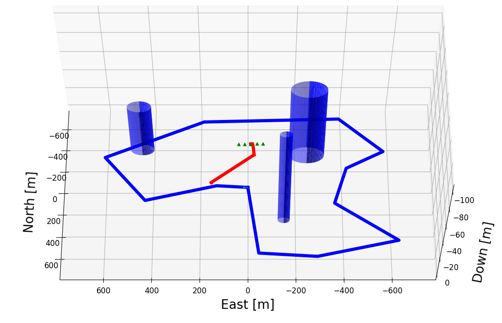

# Metis

The path planner package of the BYU UAS team.

Metis, named for the mythical Titaness and the mother of wisdom and deep thought, is
path planner package built for use with [ROSplane](https://github.com/byu-magicc/rosplane).

Metis is highly object oriented. It's guiding design philosophy is that each object or
component can operate independently of the either the rest of the program or ROS.
This means that functions are written from the standpoint of, "give me all the parameters
and values I need to be able to return the result," instead of, "tell me what you need,
and I'll go find everything I need to calculate it." The latter approach is not robust;
it leads to global variables, unclear paths of execution through the code, and takes 
maintainers on a long hunt for methods that call other services that may disappear when
a dependency's API changes.

To ensure maintainability, Metis is organized such that its ROS methods and its core functionality
are separated. Following the previously mentioned design philosophy, functions should not
directly call ROS services; rather, they should take whatever data they need as parameters,
allowing the callers to provide all necessary data.

All ROS interactions are defined in the `metis.ros` submodule. Metis routines can be run 
without importing it. 

# Installation

Metis has dependencies when used with ROS. While Metis is designed such that it can
be used alone, the installation process expects that you'll be using ROS and the BYU aerial
system. It therefore includes dependencies on other BYU packages.

ROS must be installed, which provides the `rospy` package.

Other BYU dependencies which should be installed first:

* [ROSplane](https://github.com/byu-auvsi/rosplane)
* [uav_msgs](https://github.com/BYU-AUVSI/uav_msgs)
* [interop_pkg](https://github.com/BYU-AUVSI/interop_pkg)

To install Metis, just pull the latest code from the repository into your ROS workspace.

```
# Change directory into your ROS workspace's source folder
git clone https://github.com/BYU-AUVSI/metis.git
cd metis
pip install -r requirements.txt

# Change directory back into your ROS workspace
catkin_make
```

# Testing

Metis uses the [pytest](https://docs.pytest.org/en/latest/) testing framework. Since Metis can be
run without ROS, this allows tests to be written that actually test core functionality instead
of dependencies on ROS. Test can be run in the terminal when the pytest framework is installed by
navigating to the toplevel directory of this codebase and running the following command:

```
pytest
```

Tests don't demonstrate the package's ability to plan paths; rather, it ensures the integrity
of the data structures and corresponding methods used in path planning routines. For example,
it ensures that the separation of two waypoints from each other is calculated accurately.

# ROS API

Metis provides and requires various ROS services in order to function on the BYU system.

## ROS Params Requested by Metis

These are currently provided in the .launch file that starts Metis. This may be moved to
some other globally accessible location, since several other packages also require this
information and trying to remember to change it in three places is a recipe for disaster.

* `ref_lat` Reference latitude (in decimal degrees) for home location.
* `ref_lon` Reference longitude (in decimal degrees) for home location.
* `ref_h` Reference altitude (in meters) above sea level for home location.

## ROS Services Required by Metis

Metis calls these services when used in conjunction with the full BYU system in order to
calculate its paths and objectives.

* `/get_mission_with_id` (This service should be provided by `interop_pkg`)

## ROS Services Provided by Metis

These are services provided by Metis that can be called using `rosservice call`.

* `/clear_wpts`
* `/plan_path`  
* `/plan_landing`
* `/update_search_params`  
* `/approved_path`
* `/review_path`

### Planner Commands

* `rosservice call /plan_path 0`: Waypoint Mission
* `rosservice call /plan_path 1`: Payload Mission
* `rosservice call /plan_path 2`: Search Mission
* `rosservice call /plan_path 6`: Offaxis Detection
* `rosservice call /plan_path 7`: Loiter Mission

Once the waypoints are planned, a plot appears showing the planned path.
This plot can be manipulated with the mouse to add or remove waypoints.
Once the plot has been closed, it can be reopened with the `/review_path` command.

Use the `/approved_path` command to pass the finalized waypoints to the plane.

## ROS Topics Published To by Metis

<!-- * `/current_task` -->
* `/waypoint_path`

# Running in Simulation

Run `auvsi_sil.launch`. Metis and interop_pkg still need to be included in that launch file.

OUTDATED

To run Metis in simulation, you need at least the following repositories:

- rosplane
- ros_groundstation (AUVSI-SUAS-2019 branch)
- metis

To run, execute the following commands (each will need its own shell):

```
roslaunch rosplane_sim fixedwing.launch             # Launches the simulation. Make sure to hit "play" in Gazebo.
roslaunch ros_groundstation gs_fixedwing.launch     # Launches groundstation
roslaunch metis fake_interop.launch                 # Provides a mock interop server for testing
roslaunch interop_pkg client.launch 

```

# Operation

For testing, Metis currently has a fake_interop node that supplies waypoints that would normally be supplied by the interop server. 

Metis can be run with `roslaunch metis fake_interop.launch`, which will run the fake interop node, the mission planner, node, and the path planner node. At the time of this writing, the path planner node is still not fully functional.

The various missions can be called with the `/plan_path` rosservice call. The arguments for this service call are the mission that should be run and the arguments associated with the PlanMissionPath service call. 

The plan_mission service call will return a list of the major waypoints that the aircraft needs to fly through. These may be the drop location and points leading to the drop location, points that create a lawnmower path over the search area, points that allow detection of objects outside the mission area, or objective waypoints given by the interop server.


---

### Planner Notes

# TODO
The planner can always plan from the current location if ROS is updating it in the Mission object
(or MissionManager, forgot which one).

## Payload Planner

The payload path planner is calculated using two distinct regions. The final path plan is shown below
with the boundaries and obstacles in blue, payload path in red, and calculated plane waypoints
in green.



### Commanded Release to Parachute Open
The first region is between when the command to release is given to the servo to when
the parachute is fully open.
**Assumptions:**
1. Time delay between the command release to the servo and the bay door opening is constant and known
2. Time delay between the bay door opening is constant and known (through experimentation)
3. Height difference is calculated between when the bay door opens and when the parachute opens
4. Wind is steady state (no gusts)
5. The only force acting on the payload is gravity (no aerodynamic drag, etc.)

### Parachute Open to Target
The second region is between when the parachute opens to when the payload hits the ground target
**Assumptions:**
1. Payload descends down at a constant rate which is known (through experimentation)
2. Payload moves in the North and East directions at the speed of the wind
3. No aerodynamic drag, acceleration

### Supporting Waypoints
The final step of  the payload planner is to create supporting waypoints (green triangles) so that the plane is flying in a straight line when it drops the payload.  
The planner first tries to fly directly into the wind. If that commanded chi angle
would hit an obstacle or go out of bounds, it iterates on the command chi angle by adding 15 degrees until it finds a successful waypoint path.

---

# Path Planner
`pathPlannerBase.py` is a ROS Node for planning paths between a list of waypoints. 
The planner can use either `rrt.py` or `rrtstar.py`. 

## RRT
`rrt.py` uses the RRT algorithm with small modifications for UAV flight. Adding new
nodes takes into account the relative chi angle and incline angle in order for the 
paths to be flyable. 

### Changing Altitude Between Waypoints
Most RRT algorithms that solve for paths in 3D space add points anywhere in the flyable space.
This method does find paths, but takes many iterations because most added points are in spaces 
that would logically never be flown. By assuming the vehicle will ascend and descend at the beginning
of its path, the space where points are added can be simplified back to essentially a 2D plane.
This allows for shorter solve times, and for more paths to be tested. 

---

# Coding Standard

This package adheres to the numpydoc style of documentation using Python docstrings.
Additionally, the code is formatted with the `black` code formatter provided by the 
Python Software Foundation.

# Notes

Scripts to start ROS nodes ought to be placed in /bin. Regardless of the language they are
written in, be sure to include the shebang at the top of the file; for example, in Python:

```
#! /usr/bin/env python
```

Extensions are usually left off for shell scripts and Python files. The file also needs to be marked as executable.

```
chmod u+x <filename>
```

---

To see the proper syntax for `rosservice call /plan_path <args>`, simply enter `rosservice call /plan_path` into the terminal and tab complete until it autofills a template for what the message looks like. Doing so will provide the following:

```
user:~$ rosservice call /plan_path "mission_type: 0
landing_waypoints:
  waypoint_list:
  - N: 0.0
    E: 0.0
    D: 0.0
    task: 0" 
```

To see the mission specified by `FakeInteropElberta.py`, you can run that file (`python FakeInteropElberta.py`) and then in a separate terminal call 

```
user:~/ros/uas_ws/src/metis/testingCode$ rosservice call /get_mission_with_id "mission_type: 0" 
```
