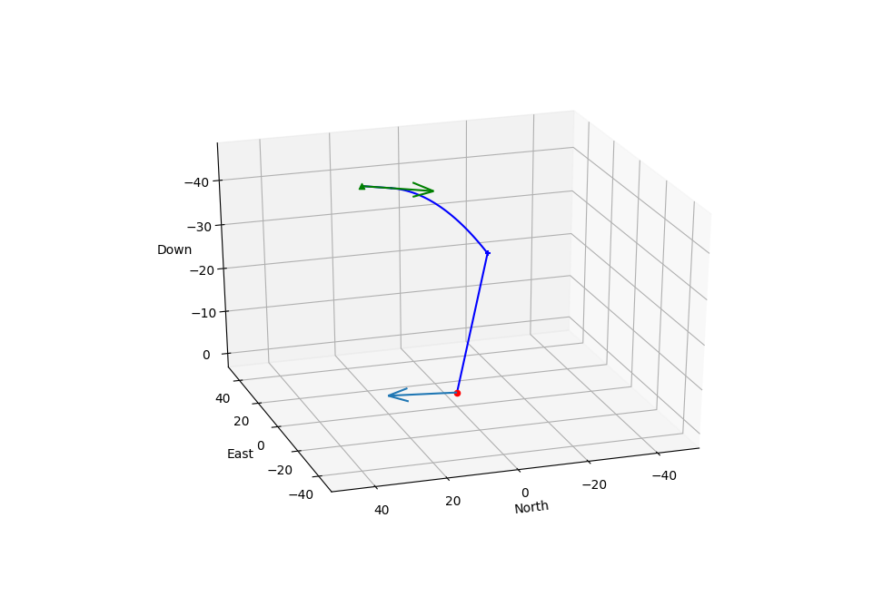

# Mission Planner

`mainPlanner.py` This is a description about the mission planner

## Objective Points Planner
This is a description about this planner

## Search Planner
This is a description about this planner

## Loiter Planner
This is a description about this planner

## Payload Planner

The payload path planner is calculated using two distinct regions

### Commanded Release to Parachute Open
The first region is between when the command to release is given to the servo to when
the parachute is fully open.
**Assumptions:**
1. Time delay between the command release to the servo and the bay door opening is constant and known
2. Time delay between the bay door opening is constant and known (through experimentation)
3. Height difference is calculated between when the bay door opens and when the parachute opens
4. Wind is steady state (no gusts)
5. The only force acting on the payload is gravity (no aerodynamic drag, etc.)

### Parachute Open to Target
The second region is between when the parachute opens to when the payload hits the ground target
**Assumptions:**
1. Payload descends down at a constant rate which is known (through experimentation)
2. Payload moves in the North and East directions at the speed of the wind
3. No aerodynamic drag, acceleration

### Supporting Waypoints
The final step of  the payload planner is to create supporting waypoints (green triangles) so that the plane is flying in a straight line when it drops the payload.  
The planner first tries to fly directly into the wind. If that commanded chi angle
would hit an obstacle or go out of bounds, it iterates on the command chi angle by adding 15 degrees until it finds a successful waypoint path.

## Current Task
This is a description about this planner
